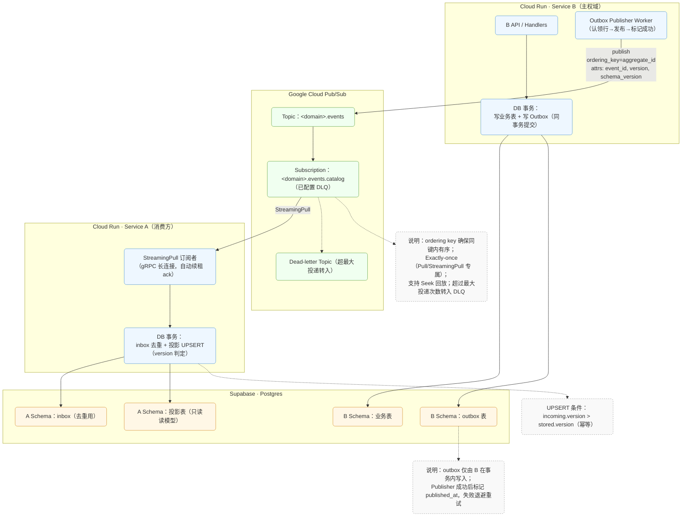

# 只读投影方案

Created: October 24, 2025 3:10 AM
Tags: 方案设计

基于 **Go + Cloud Run + Supabase(Postgres) + Pub/Sub** 的** **Outbox Publisher 与 StreamingPull 消费者微服务框架方案文档**。

覆盖两条链路：**(1) 写入主权数据 + Outbox，服务自身发布到 Pub/Sub（不使用 CDC）**；**(2) 服务以 StreamingPull 建立持久连接，事件驱动更新本地副本表**。

---

## **0. 目标与原则**

- **数据主权**（database-per-service）：每个微服务只写自己的库与读模型；跨域数据通过事件副本解决，避免分布式 JOIN。
- **可靠发布**：用 **Transactional Outbox** 规避“双写问题（写库 + 发消息）”不一致；发布失败可重试，最终一定上总线。
- **事件驱动消费**：订阅端走 **StreamingPull（gRPC 长连接）**，**非轮询**、高吞吐、低延迟；客户端自动续租 ack 期限。
- **幂等 + 有序**：以 **event_id / version** 做幂等，**ordering key** 确保同聚合内顺序。
- **可回放/重建**：通过 Pub/Sub **Seek**、保留/回放策略对读模型重建。
- **运行环境**：Cloud Run 支持 gRPC（HTTP/2）；StreamingPull 属后台任务，建议 **实例计费（CPU 始终分配）** + 按需最小实例数。

---

## **1. 架构总览**



- **写入链（B）**：业务表与 **Outbox** 同事务提交；随后 **Publisher** 扫描 Outbox 并发布到 Pub/Sub。
- **消费链（A）**：以 **StreamingPull** 收到消息 → 事件驱动回调中执行业务事务（幂等 UPSERT）→ 成功后 **Ack**。客户端在处理期间会自动**续租** ack 期限，避免超时重投。

---

## **2. 事件契约与主题规划**

### **2.1 主题与订阅命名**

- 主题：<bounded-context>.events（如：video.events）。
- 订阅：<topic>.<consumer-service>（如：video.events.catalog）。
- **一个消费者服务 = 一条订阅**，便于独立扩缩容、滞后监控与专属 DLQ。

### **2.2 Ordering key（强烈建议）**

- 将同一聚合（如 video_id 或 user_id）的事件使用 **相同 ordering key** 发布，可保证**同键内有序**投递。

### **2.3 Schema（推荐 Protobuf/Avro）**

- 使用 **Pub/Sub Schema** 约束消息体（Avro/Protobuf），形成发布/订阅契约与向后兼容演进。

---

## **3. 模块一：服务写 Outbox，自行发布至 Pub/Sub（不使用 CDC）**

### **3.1 事务边界（应用层）**

- 在一次数据库事务中：**先写业务表 → 再写 outbox** 一行，**一起提交**。这消除了“写库成功但消息未发”的一致性漏洞。

**Outbox 表 DDL（示例）**

表本身的结构是固定的，所有微服务通用的，每个微服务无论自己的主权多少张表也维护同一张outbox表即可。必要时在**单个服务内**按需再拆多张同结构表（用于分区/留存/吞吐）

```sql
CREATE TABLE app_outbox (
  id               uuid PRIMARY KEY,
  aggregate_type   text        NOT NULL,   -- e.g. "video"
  aggregate_id     text        NOT NULL,   -- e.g. "v_123"
  event_type       text        NOT NULL,   -- e.g. "VideoPublished"
  version          bigint      NOT NULL,   -- 单聚合内递增
  schema_version   int         NOT NULL DEFAULT 1,
  payload          bytea       NOT NULL,   -- protobuf bytes 或 jsonb
  occurred_at      timestamptz NOT NULL DEFAULT now(),
  published_at     timestamptz,            -- 成功发布后打点
  publish_attempts int         NOT NULL DEFAULT 0,
  next_retry_at    timestamptz,
  lock_token       text,                   -- 发布"租约"标记
  locked_at        timestamptz
);
CREATE INDEX ON app_outbox (published_at) WHERE published_at IS NULL;
CREATE INDEX ON app_outbox (next_retry_at) WHERE published_at IS NULL;
```

**写请求中的事务伪代码（Go/pgx）**

```go
tx, _ := db.Begin(ctx)
defer tx.Rollback(ctx)

// 1) 写业务表...
// 2) 写 outbox
_, _ = tx.Exec(ctx, `
  INSERT INTO app_outbox (id, aggregate_type, aggregate_id, event_type, version, payload)
  VALUES ($1,$2,$3,$4,$5,$6)
`, eventID, "video", videoID, "VideoPublished", version, payload)

_ = tx.Commit(ctx)
```

### **3.2 Outbox Publisher（服务内后台 worker 或独立 Cloud Run Job）**

**职责**：周期性“认领”未发布的 outbox 行 → 发布到 Pub/Sub → 标记 published_at。

**并发安全**：用 FOR UPDATE SKIP LOCKED 做**行级抢占**，避免多实例重复处理。

**认领 + 发布（示例 SQL + Go 伪代码）**

```sql
-- 一次认领 N 条可发布记录（跳过别的实例已锁定的行）
WITH cte AS (
  SELECT id FROM app_outbox
   WHERE published_at IS NULL
     AND (next_retry_at IS NULL OR next_retry_at <= now())
   ORDER BY occurred_at
   LIMIT 200
   FOR UPDATE SKIP LOCKED
)
UPDATE app_outbox o
   SET lock_token = $1, locked_at = now()
  FROM cte
 WHERE o.id = cte.id
RETURNING o.*;
```

> SKIP LOCKED 允许在高并发下高效分配工作而不互相阻塞。
> 

```go
// 对每条被认领的 outbox 记录：
res := topic.Publish(ctx, &pubsub.Message{
    Data: payloadBytes,
    OrderingKey: aggregateID, // 与读侧查询维度一致
    Attributes: map[string]string{
        "event_id": eventID.String(),
        "event_type": "VideoPublished",
        "aggregate_id": aggregateID,
        "version": strconv.FormatInt(version,10),
        "schema_version": "1",
        "occurred_at": occurredAt.Format(time.RFC3339Nano),
    },
})
// 建议启用发布端的有序支持（见官方示例）
msgID, err := res.Get(ctx) // 等待服务器确认后再标记 published
```

> 发布端支持 ordering key；官方示例展示了如何启用与使用。
> 

**成功/失败标记（示例）**

```sql
-- 成功
UPDATE app_outbox
   SET published_at = now(), lock_token = NULL, locked_at = NULL
 WHERE id = $1 AND lock_token = $2;

-- 失败：回退租约并设置退避
UPDATE app_outbox
   SET publish_attempts = publish_attempts + 1,
       next_retry_at = now() + (publish_attempts || ' minutes')::interval,
       lock_token = NULL, locked_at = NULL
 WHERE id = $1 AND lock_token = $2;
```

> 为何不用“直接发 Pub/Sub”替代 Outbox？
> 

> 为避免“双写问题”，需要把“写库 + 记录事件”绑定在同一事务（Outbox），再异步可靠发布。
> 

### **3.3 IAM 与最小权限**

- 该服务的 **Service Account** 赋予目标 Topic 的 roles/pubsub.publisher 即可。
- 数据库凭证只授予本服务 schema。

---

## **4. 模块二：服务以 StreamingPull 持久连接，更新本地副本表**

### **4.1 订阅侧（Go 高阶客户端）**

- 使用 sub.Receive(ctx, handler) 建立 **StreamingPull**；库会**自动续租 ack**，直到你 Ack/Nack 或达到 MaxExtension。这是**事件驱动回调**，非轮询。
- 可选开启 **Exactly-once delivery（EOD）**（仅 Pull/StreamingPull 支持），以确保“成功 ack 后不再重投”。
- 如果你有**多个微服务实例（subscriber 客户端）都连接到 *同一个订阅（subscription）*** 并使用 Pull 或 StreamingPull，那么系统内部确实会做一种“负载分配”机制，把订阅中的消息分发给这些实例中的 *一个* 来处理。我们不需要也不能精确控制，但需要确保所有订阅的消费者都是幂等的（idempotent）——因为负载分配不保证精确，你可能因为重试、ack deadline 过期等情形，某些消息被重新分配或重复。官方说明：“虽然通常一条消息只会交付给订阅内一个客户端，但在ack deadline过期或网络断等情况下，可能会重新投递给同一个或不同客户端。”

**订阅端骨架（Go）**

```go
client, _ := pubsub.NewClient(ctx, projectID)
sub := client.Subscription(subID)
sub.ReceiveSettings.NumGoroutines = 1
sub.ReceiveSettings.MaxOutstandingMessages = 1024
sub.ReceiveSettings.MaxOutstandingBytes = 64 << 20 // 64MiB

err := sub.Receive(ctx, func(ctx context.Context, m *pubsub.Message) {
    evt, err := decode(m.Data)             // 反序列化 Protobuf/JSON + 校验
    if err != nil { m.Nack(); return }

    tx, _ := db.Begin(ctx)
    // 1) inbox 幂等去重（消费者侧邮箱）
    if _, err := tx.Exec(ctx, `
      INSERT INTO inbox(event_id, received_at) VALUES ($1, now())
      ON CONFLICT (event_id) DO NOTHING
    `, evt.Id); err != nil { tx.Rollback(ctx); m.Nack(); return }

    // 2) 投影幂等 UPSERT（仅在 incoming.version > stored.version 时覆盖）
    if _, err := tx.Exec(ctx, `
      INSERT INTO catalog_read.video_projection(video_id, title, version, updated_at)
      VALUES ($1,$2,$3,now())
      ON CONFLICT (video_id) DO UPDATE
      SET title=EXCLUDED.title, version=EXCLUDED.version, updated_at=now()
      WHERE catalog_read.video_projection.version < EXCLUDED.version
    `, evt.VideoId, evt.Title, evt.Version); err != nil {
        tx.Rollback(ctx); m.Nack(); return
    }
    if err := tx.Commit(ctx); err != nil { m.Nack(); return }
    m.Ack() // 只有在事务成功后才 Ack，保证状态与事件一致
})
```

> Go 客户端的 Receive 会在消息到达时先发送 ack 期限延长，并在处理期间自动续租；这使得长事务也能安全处理。
> 

### **4.2 投影/副本表 DDL（示例）**

```sql
CREATE TABLE catalog_read.video_projection (
  video_id   uuid PRIMARY KEY,
  title      text,
  version    bigint      NOT NULL,
  updated_at timestamptz NOT NULL
);

-- 消费者侧 inbox：用于去重/审计
CREATE TABLE catalog_read.inbox (
  event_id    uuid PRIMARY KEY,
  received_at timestamptz NOT NULL
);
```

### **4.3 失败与重试**

- **DB 临时失败**：Nack 或不 Ack，消息**至少一次**重投；可设置 **Dead-letter topic** 在达到最大尝试后转入 DLQ。
- **顺序/并发控制**：通过 **ordering key** 与 ReceiveSettings.* 做流控；同 key 单线程语义由 Pub/Sub 保证。
- **EOD（可选）**：启用后用 AckWithResult/NackWithResult 检查确认，代价是略增延迟。

### **4.4 Cloud Run 运行形态**

- 订阅消费者是**后台任务**；在 Cloud Run 上建议使用 **实例计费（CPU 始终分配）**，必要时设 **min instances ≥ 1** 以维持连接与稳定延迟。

---

## **5. 消息格式与演进**

### **5.1 Protobuf（建议）/JSON**

- 建议使用 **Protobuf + Pub/Sub Schema**，体积小、强类型；消费者以 schema 版本号做兼容处理（新增字段向后兼容）。

**示例（proto）**

```go
message VideoPublished {
  string event_id       = 1;  // uuid
  string video_id       = 2;
  string title          = 3;
  int64  version        = 4;  // 单聚合内递增
  int64  occurred_at_ms = 5;
}
```

发布端附带 attributes：

```go
event_id, event_type, aggregate_id, version, schema_version, occurred_at
```

---

## **6. 监控、告警与可观测**

- **订阅滞后**：Dashboard/告警关注 num_unacked_messages、oldest_unacked_message_age、**delivery latency health score**。
- **回放能力**：启用保留已确认消息并使用 **Seek**（timestamp/snapshot）回放重建投影。
- **应用指标**：
    - 发布器：publish_attempts、失败率、平均重试间隔、Outbox 积压。
    - 消费者：处理时长 P50/P95、Nack 比例、投影版本滞后（事件 version - 表 version）。
- **日志追踪**：统一打印 event_id / messageId / ordering_key 便于端到端排障。

---

## **7. 安全与 IAM**

- **发布者 SA**：仅授 roles/pubsub.publisher（到指定 Topic）。
- **订阅者 SA**：仅授 roles/pubsub.subscriber（到指定 Subscription）。
- **数据库**：每服务独立 DB 用户、仅本 schema 最小权限；Outbox/投影表不做跨库外键。

---

## **8. 回填与冷启动**

- **历史全量**：由 B 生成“全量快照事件”或单独导出现有状态，A 在**停止对外前**先构建投影表，再切流。
- **增量追尾**：投影完成后，再开启对 *.events 的 StreamingPull，按 offset 追平。
- **重建**：使用 **Seek** 将订阅回拨到指定时间点重放（需启用 retain-acked-messages）。

---

## **9. 代码骨架（汇总）**

### **9.1 事务写 Outbox（片段）**

```go
// tx 写业务 + outbox
type OutboxRow struct {
  ID            uuid.UUID
  AggregateType string
  AggregateID   string
  EventType     string
  Version       int64
  Payload       []byte
}
```

（见 §3.1 事务示例）

### **9.2 Outbox Publisher（任务循环）**

```go
for {
  rows := claimOutboxRows(ctx, token, 200) // 用 SKIP LOCKED 认领
  if len(rows) == 0 { time.Sleep(time.Second); continue }

  for _, r := range rows {
    res := topic.Publish(ctx, &pubsub.Message{
      Data: r.Payload, OrderingKey: r.AggregateID,
      Attributes: map[string]string{ "event_id": r.ID.String(), /* ... */ },
    })
    if _, err := res.Get(ctx); err != nil {
      markFail(ctx, r.ID, token)   // attempts++, next_retry_at
      continue
    }
    markSuccess(ctx, r.ID, token)  // published_at = now()
  }
}
```

> FOR UPDATE SKIP LOCKED：多实例并行认领而不互相阻塞。
> 

### **9.3 StreamingPull 消费者（见 §4.1）**

---

## **10. Cloud Run 部署要点**

- **gRPC/API 服务** + **StreamingPull 消费者**可**同进程**共存；如仅做消费者，也可独立成一个“consumer”服务。
- 若要同时提供 gRPC 与 HTTP（诊断/健康检查），在同一端口启用 HTTP/2 并在应用内做多路复用；Cloud Run 支持端到端 HTTP/2。
- **实例计费**：后台工作负载（StreamingPull）推荐启用 **CPU 始终分配**；若需 24×7 常连，配置 **最小实例数**。

---

## **11. 风险与对策**

| **风险** | **对策** |
| --- | --- |
| 发布器宕机/抖动导致 Outbox 积压 | Outbox 认领 + 重试退避、水平扩容发布器实例；监控积压阈值告警 |
| 重复发布/重复消费 | **发布端**允许重复（以消费端幂等兜底）；**消费端**使用 inbox(event_id) + version 比较 |
| 顺序要求 | 使用 **ordering key**；单键内顺序由 Pub/Sub 保证（同区域）。 |
| 长事务处理超时 | Go 客户端自动续租 ack 期限；或拆小事务。 |
| 毒消息反复重试 | 订阅开启 **Dead-letter topic** + 告警与人工干预。 |
| 回放/重建需要 | 启用消息保留并用 **Seek** 回拨至时间或快照。 |

---

## **12. 验收清单（Checklist）**

- 业务写路径已将 **Outbox 插入**纳入同一事务。
- 发布器使用 FOR UPDATE SKIP LOCKED 认领、published_at 标记与退避重试。
- Pub/Sub 主题/订阅创建完毕，**订阅启用 DLQ**，必要时启用 **EOD**。
- 发布端设置 **ordering key**；协议 Schema 已注册（Avro/Protobuf）。
- 订阅端使用 **StreamingPull**，处理成功后再 Ack；失败 Nack/不 Ack。
- 投影表与 **inbox(event_id)** 已部署，UPSERT 使用 WHERE version < incoming.version。
- Cloud Run 采用 **实例计费**（后台任务），按需设置 **min instances**。
- 观测面：订阅滞后、Outbox 积压、DLQ 告警、端到端 trace。）
- 事务 Outbox 模式与动机。
- Pub/Sub StreamingPull 与高阶客户端的租约/续租。
- Push 订阅基于 HTTPS（本文方案未使用 Push，仅作为对比）。
- Exactly-once delivery（仅 Pull/StreamingPull）。
- Ordering key 语义与发布示例。
- Pub/Sub Schema（Avro/Protobuf）。
- Cloud Run HTTP/2/gRPC、实例计费与最小实例。
- Postgres FOR UPDATE SKIP LOCKED。

结论：**每个微服务在“自己的数据库/Schema”里维护一张通用的 outbox 表即可**（与业务表同库、同事务）；**表结构建议在全公司层面统一一个“规范化最小集合”**，但并不是标准强制——可按需要增加少量字段。不要做所有服务共用的一张全局表。

# **13 实现细节**

## **1. OUTBOX配置**

为什么是一“服务一张表”（且结构尽量统一）：

- **同库同事务**：outbox 必须与业务写入在同一事务提交，避免“双写不一致”；这要求 outbox 就在**该服务自己的库**里。
- **结构统一利于工程化**：像 Debezium 的 **Outbox Event Router** 默认就假设 outbox 含 id/aggregatetype/aggregateid/type/payload 等通用列，并允许自定义/扩展；如果一个连接器要抓取多张 outbox 表，**要求这些表结构一致**。这也说明“规范化结构可通用到所有服务”。
- **每个微服务各自维护一张通用 outbox 表（同库同事务）**；公司层面统一列名/语义，便于复用工具链。
- **结构不是“硬性固定”，而是“统一的最小规范 + 可增补字段”**；aggregatetype/aggregateid/type/payload 是 outbox 的通用“语义最小集”；Debezium 文档把它作为**默认结构**并支持定制/扩展字段。如果未来切换到 **CDC**（Debezium/Datastream），**官方建议 outbox 是“仅插入（append-only）”**；此时可把 published*/ lock*等派发状态移到另一张“派发表”，保持 outbox 本身不做 UPDATE。
- 一个服务是否只要“一张”outbox：默认一张足够，同一服务里不管你有多少业务表，事件都落在这张通用 outbox；用 aggregatetype/aggregateid 区分来源聚合即可。极端高吞吐需要分区/不同保存策略时，可以在**同一服务内**按事件族拆成多张“结构一致”的 outbox 表；像 Debezium 也允许一个连接器抓取**多张结构相同**的 outbox 表。
- 派发器与并发认领（自发布场景）：后台 Publisher 用 SELECT … FOR UPDATE SKIP LOCKED 批量“认领”未发布行 → 发布到 Pub/Sub（等待服务器确认）→ 成功后标记 published_at；失败退避重试。这样多实例并发也不会重复处理同一行。

**推荐的"公司统一"最小结构**

```sql
CREATE TABLE app_outbox (
  id               uuid        PRIMARY KEY,     -- 事件唯一ID（幂等用）
  aggregatetype    text        NOT NULL,        -- 聚合类型（如 "video"）
  aggregateid      text        NOT NULL,        -- 聚合ID（ordering key）
  event_type       text        NOT NULL,        -- 事件类型（如 "VideoPublished"）
  version          bigint      NOT NULL,        -- 聚合内单调递增版本
  payload          jsonb       NOT NULL,        -- 事件载荷（或存 protobuf bytes）
  occurred_at      timestamptz NOT NULL DEFAULT now(),

  -- 仅"自发布"需要的派发状态列（CDC 模式下可移除或放到单独表）
  published_at     timestamptz,
  publish_attempts int         NOT NULL DEFAULT 0,
  next_retry_at    timestamptz,
  lock_token       text,
  locked_at        timestamptz
);
```

## **2. OUTBOX扫描频率**

**采用“事件唤醒 + 自适应回退”的混合策略**最稳：

1. 事务里写入 outbox 的同时，对一个 Postgres channel 执行 **NOTIFY**；发布器后台进程 **LISTEN** 到通知后立即扫描（近实时、低延迟）。通知只在 **事务提交后** 送达，天然与业务提交一致。
2. 作为兜底，保持一个 **退避带抖动（jitter）的轮询**：有活就紧扫、无活就指数回退；避免空转和惊群。

> AWS 的 Outbox 指南也采用“**定期扫描 outbox 表**，频率可配置”的思路；我们在此基础上用 LISTEN/NOTIFY 将“有活时”的延迟拉到最低。
> 

---

### **推荐频率策略（可直接抄）**

**目标延迟**不同，频率不同；下面是工程上常用的“起步参数”，按压测再微调：

- **有活（本轮扫到记录）**：**立即**下一轮（不 sleep，直到批次清空）。
- **刚被唤醒（收到 NOTIFY）**：**立刻**扫描一次。
- **无活（本轮 0 条）**：**指数回退 + full jitter**（示例：base=250ms → 500ms → 1s → 2s → 4s → … → 上限 30s，每次乘随机 0~1 抖动）。
- **发布失败**：把该行的 next_retry_at 设为退避时间点（同样指数回退 + 抖动），到点再被扫描认领。
- **批量大小**：每轮 **100~500** 行为宜（按库与总线吞吐调），查询用 **FOR UPDATE SKIP LOCKED** + ORDER BY occurred_at 认领，保证并发安全与顺序友好。

> 业界文章也建议「**每几秒** 扫一次」作为基线；在此之上，用 NOTIFY 把有活场景拉成“几百毫秒级”延迟。
> 

---

### **查询与并发认领（要点）**

- 认领语句：
    
    … WHERE published_at IS NULL AND (next_retry_at IS NULL OR next_retry_at <= now()) ORDER BY occurred_at LIMIT N FOR UPDATE SKIP LOCKED
    
    多实例并发时不会互相阻塞，适合“队列式”并行处理。
    
- 有序性：发布到 Pub/Sub 时用 **ordering key**（如 aggregate_id）保持同键内顺序；扫描时按生成顺序拿批次。
- 避免空转：LISTEN/NOTIFY 能显著减少无效扫描；但 **NOTIFY 仅对在线会话有效且 payload ≤ 8KB**，不能替代持久队列，因此**必须保留轮询兜底**。

---

### **在 Cloud Run 上如何跑**

- 让发布器作为**后台 worker**常驻（与 API 同进程或独立服务均可）。启用 **CPU 始终分配（Always-on CPU）**，这样即使无入站请求也能 LISTEN/轮询与发布。
- 量小、追求极致省钱时，可关闭常驻，仅用**定时触发（Cloud Scheduler 调用一个 drain 端点）**做低频轮询；但延迟会上升（不建议在生产主链路）。

---

### **频率如何“自适应”**

把扫描间隔与队列深度/命中率联动：

- 命中（拿到记录）→ 重置回 **最小间隔**（0~250ms）。
- 连续 N 次未命中 → 指数回退到 **最大间隔**（10~30s）。
- 队列深（每轮都拿满）→ **提批量或并发实例数**；队列浅 → 降并发与批量。
    
    这一类“命中驱动 + 回退”的策略，和 AWS/Google 对**退避 + 抖动**的通用建议一致，能显著减少峰值抖动与惊群。
    

---

### **监听唤醒怎么做**

- 在**同一事务**里 INSERT … INTO outbox … 后立即 NOTIFY outbox_wake, '<轻量payload>'；通知会 **随事务提交后** 才送达，保证与业务状态一致。
- worker 端持久连接执行 LISTEN outbox_wake，收到后立刻扫描一轮。
- 注意：**NOTIFY 不是持久队列**（离线时会丢），payload 有 **8KB 限制**；因此**仅作低延迟唤醒**，不是唯一机制。
- 写入量极大且并发写者众多时，LISTEN/NOTIFY 在某些高压场景可能出现扩展性瓶颈；这时可**降低 NOTIFY 频次**（聚合/节流）或仅靠轮询。

---

### **参考“起步模板”（伪代码思路）**

```go
interval = 0
while true:
  if got_notify: interval = 0

  rows = claim_outbox_batch(limit=N)   -- FOR UPDATE SKIP LOCKED
  if rows > 0:
     publish_batch(rows)               -- 同步等待服务端确认
     mark_published(rows)
     interval = 0                      -- 继续紧扫
     continue

  # 没有待发行 → 回退 + 抖动
  interval = min(maxInterval, max(base, interval*2)) * rand(0,1)
  sleep(interval)
```

> base 推荐 250ms；maxInterval 10~30s 起步；命中重置为 0ms。退避策略使用 **jitter** 可避免多实例同频率冲撞。
> 

---

### **为什么这样定频率是“对的”**

- **有据可依**：业界/官方把 outbox 处理描述为“**定期扫描** outbox 并投递”的作法，频率可配置；我们在此基础上引入 **LISTEN/NOTIFY** 以降低“有活场景”的首字节延迟。
- **并发安全**：用 **FOR UPDATE SKIP LOCKED** 做无阻塞认领，天然适配多实例并行。
- **成本友好**：无活时指数回退 + 抖动，配合 Cloud Run 背景执行，低 CPU 占用且能快速被唤醒。

---

### **快速 Checklist**

- 扫描：命中紧扫；未命中 **指数回退 + 抖动**。
- 唤醒：LISTEN/NOTIFY（提交后送达），仅作低延迟唤醒，保留轮询兜底。
- 认领：FOR UPDATE SKIP LOCKED + 批量 100~500。
- 失败：next_retry_at 指数退避；重试到点再认领。
- Cloud Run：启用 **Always-on CPU** 运行后台 worker。

你要的话，我可以把这一套参数（回退曲线、LISTEN/NOTIFY 唤醒、SKIP LOCKED 认领、发布成功/失败的 next_retry_at 调度）直接打包成一个可复用的 **Go outbox 发布器**小库，给你默认值、metrics、以及 Cloud Run 的部署样例。

## 3. OUTBOX payload

可以根据业务场景灵活决定 **payload** 应该是什么范围。**可以**是插入或更新后那条记录的完整数据快照，但更准确是：“事件所需的数据快照或变更内容”，具体取决于业务需要和下游服务契约，而非必须要“原始数据库行全部字段”。

---

### **情景划分：插入 / 更新 / 删除**

| **动作类型** | **payload 建议内容** | **说明** |
| --- | --- | --- |
| **插入（Insert）** | 通常**包含完整单行数据**（即你刚插入记录的所有重要字段） | 因为下游可能需要该实体初始状态，直接取快照方便“读模型”或者副本初始化。 |
| **更新（Update）** | 可以**只包含更改过的字段（或新增字段 +老字段值）**，也可包含完整快照，取决于下游需求 | 如果下游只关心“哪些字段变了”就没必要传所有字段；如果下游可能需要“当前整行”状态，则传完整更简单。 |
| **删除（Delete）** | payload 可以是“标识该实体已删除”的简略内容（如 aggregate_id），或包含删除前状态快照 | 通常下游服务只需知道“此 ID 被删除”即可，无需整条旧数据除非业务需要审计或保留历史。 |

---

### **✅ 推荐实践（结合你的微服务 + outbox 场景）**

- 对 **插入**：推荐把那条新增记录中“对下游有意义”的字段全部塞进 payload。这样出事件后，下游服务可直接用 payload 构建其投影/副本，而不必回查询源服务。
- 对 **更新**：如果你控制得很好、且下游只关心部分变更字段／状态，就只发送“变更字段 + 新值”作为 payload。这样消息体更轻、网络更节省。但如果业务复杂或者下游可能需要整条数据，就发送完整快照也没问题。
- 对 **删除**：发送一个删除事件（如 VideoDeleted），payload 里至少包含 video_id，还可以包含 deleted_at 或者删除前关键字段（如标题）— 看你下游是否需要。

---

### **⚠️ 注意事项**

- 一定要在消息契约（event schema）里**清晰定义** payload 内容：哪些字段必有、哪些字段可选、版本如何演进。避免“随机字段结构不一致”导致下游错误。
- 如果你只发送“变更字段”而下游有可能要“完整状态”但没拿到，就会产生耦合或回查源服务的情况，所以设计前要确认下游需求。
- 删除事件也不一定要“空 payload”——如果有审计/追踪需要，可以包含删除前快照。但若只需标识删除，则简洁为佳。
- 无论哪种方式，消费者服务必须具备**幂等处理能力**，因为可能会重复收到事件。即便 payload 是完整或部分变更字段，也必须安全处理。

---

## **事件 schema 示例**

（比如 “VideoCreated”, “VideoUpdated”, “VideoDeleted” 三种事件类型）

好的，下面是为 “视频” 这一聚合设计的 **三个事件类型**：VideoCreated（创建）、VideoUpdated（更新）、VideoDeleted（删除）。我会分别给出：

- 每个事件的 payload 字段建议
- 对应的 Go 结构体定义
- 对应的 Protobuf .proto 定义

这样你可以直接拿来在微服务中使用或稍作调整。

---

### **1. 事件：VideoCreated**

**Payload 字段建议**

当一个视频元数据被插入（创建）时，建议 payload 包含：

- video_id：String/UUID，视频唯一标识
- uploader_id：String/UUID，上传者标识
- title：String，视频标题
- description：String，可选，视频描述
- duration_seconds：Int64，视频时长（秒）
- published_at：Timestamp，视频发布/上线时间
- version：Int64，聚合版本号（如果你采用版本控制）
- occurred_at：Timestamp，事件发生时间／写入 outbox 的时间（可能由系统生成）

### **Go 结构体**

```
type VideoCreatedPayload struct {
    VideoID         string    `json:"video_id"`
    UploaderID      string    `json:"uploader_id"`
    Title           string    `json:"title"`
    Description     *string   `json:"description,omitempty"`
    DurationSeconds int64     `json:"duration_seconds"`
    PublishedAt     time.Time `json:"published_at"`
    Version         int64     `json:"version"`
    OccurredAt      time.Time `json:"occurred_at"`
}
```

### **Protobuf 定义**

```
syntax = "proto3";
package video.events;

import "google/protobuf/timestamp.proto";

message VideoCreated {
  string video_id         = 1;
  string uploader_id      = 2;
  string title            = 3;
  string description      = 4;               // optional: may be empty
  int64  duration_seconds = 5;
  google.protobuf.Timestamp published_at = 6;
  int64  version          = 7;
  google.protobuf.Timestamp occurred_at  = 8;
}
```

---

## **2. 事件：VideoUpdated**

### **Payload 字段建议**

当视频元数据被更新时，payload 可以包含：

- video_id：String
- version：Int64，新版本号
- 然后只包含那些“**被更新过的字段**”，例如：
    - title（可选）
    - description（可选）
    - duration_seconds（可选）
    - published_at（可选）
- occurred_at：Timestamp，事件时间

这种设计允许下游服务只看到发生变更的字段，而不是完整快照（如果业务允许）。如果你希望保证下游始终拿到完整状态，也可以在更新事件里直接包含完整行数据。

### **Go 结构体**

```
type VideoUpdatedPayload struct {
    VideoID         string     `json:"video_id"`
    Version         int64      `json:"version"`
    Title           *string    `json:"title,omitempty"`
    Description     *string    `json:"description,omitempty"`
    DurationSeconds *int64     `json:"duration_seconds,omitempty"`
    PublishedAt     *time.Time `json:"published_at,omitempty"`
    OccurredAt      time.Time  `json:"occurred_at"`
}
```

### **Protobuf 定义**

```
syntax = "proto3";
package video.events;

import "google/protobuf/timestamp.proto";

message VideoUpdated {
  string video_id = 1;
  int64  version  = 2;

  // optional fields (Proto3 treats them as set/unset)
  string title            = 3;
  string description      = 4;
  int64  duration_seconds = 5;
  google.protobuf.Timestamp published_at = 6;

  google.protobuf.Timestamp occurred_at = 7;
}
```

---

## **3. 事件：VideoDeleted**

### **Payload 字段建议**

当视频被删除时，payload 可以包含：

- video_id：String
- version：Int64（如果你保留版本）
- deleted_at：Timestamp，删除时间
- occurred_at：Timestamp，事件发出时间
- (可选) reason：String，删除原因（如“违规”或“用户主动”）

### **Go 结构体**

```
type VideoDeletedPayload struct {
    VideoID    string    `json:"video_id"`
    Version    int64     `json:"version"`
    DeletedAt  time.Time `json:"deleted_at"`
    OccurredAt time.Time `json:"occurred_at"`
    Reason     *string   `json:"reason,omitempty"`
}
```

### **Protobuf 定义**

```
syntax = "proto3";
package video.events;

import "google/protobuf/timestamp.proto";

message VideoDeleted {
  string video_id = 1;
  int64  version  = 2;
  google.protobuf.Timestamp deleted_at  = 3;
  google.protobuf.Timestamp occurred_at = 4;
  string reason                = 5;  // optional
}
```

---

## **4. 事件封装（可选）**

为了统一处理不同事件类型，你也可以定义一个“通用事件 Envelope”，比如：

### **Protobuf Enveloper 定义**

```
syntax = "proto3";
package video.events;

import "google/protobuf/timestamp.proto";

enum EventType {
  EVENT_TYPE_UNSPECIFIED = 0;
  VIDEO_CREATED           = 1;
  VIDEO_UPDATED           = 2;
  VIDEO_DELETED           = 3;
}

message Event {
  string          event_id     = 1;
  EventType       event_type   = 2;
  string          aggregate_id = 3;
  string          aggregate_type = 4; // e.g. "video"
  int64           version      = 5;
  google.protobuf.Timestamp occurred_at = 6;

  oneof payload {
    VideoCreated created = 10;
    VideoUpdated updated = 11;
    VideoDeleted deleted = 12;
  }
}
```

### **Go 结构体（伪代码）**

```
type Event struct {
    EventID       string        `json:"event_id"`
    EventType     EventTypeEnum `json:"event_type"`
    AggregateID   string        `json:"aggregate_id"`
    AggregateType string        `json:"aggregate_type"`
    Version       int64         `json:"version"`
    OccurredAt    time.Time     `json:"occurred_at"`
    Payload       interface{}   // either VideoCreatedPayload, VideoUpdatedPayload, VideoDeletedPayload
}
```

---

## **5. 针对你的架构的建议**

- 使用 Protobuf 定义事件 schema 有助于**强类型、跨语言、schema 演进**。
- 在 outbox 表里，可以将 payload 存为 **Protobuf bytes** 或 **JSON 字符串**，视你系统需求而定。
- 发布到 Pub/Sub 时，以上述 Protobuf message 或 JSON 序列化为消息体。
- 消费端解析后按 event_type 分发到对应处理逻辑。
- 确定 schema 演进策略：Protobuf 官方给出兼容规则（如新增字段、保留字段编号等）以保证消费者不会破坏。

---

## 6. Engagement Runner 的 offsetProvider 设计与使用

> **目标**：让 Catalog 的 Engagement 投影在任何情况下都能“知道自己处理到哪儿了”，同时支持回放/重建与多实例协作。

### 6.1 为什么需要 offsetProvider

1. **故障恢复不丢数据**：Pub/Sub 默认 *at-least-once* 投递。如果 Runner 在消费完消息后 crash，又没有持久化位点，恢复时要么重复处理（造成脏数据），要么直接错过已 ack 的消息（造成缺口）。持久化 offset 可以让我们从精确位置继续。
2. **支持历史回放与重建**：`catalog.video_user_engagements_projection` 是一个派生投影。遇到 Schema 迁移、批量修复或灾难恢复时，需要把 Engagement 历史事件重新跑一遍。offsetProvider 允许我们把位点“拨回”指定时间/消息 ID，安全地从头重放。
3. **提供运维可观测性**：记录 offset 之后，可以实时得知 Runner 当前消费到哪条消息、距最新消息落后多少（lag），便于排查积压、告警、手动干预。
4. **支持多实例协作**：生产环境可能需要多实例 Runner 做高可用。如果仅靠内存记录进度，各实例状态无法协调；把 offset 放到共享存储后，任一实例接手时都能继承进度，避免重复工作。

### 6.2 设计目标

- **幂等**：重复写入同一 offset 不应引发错误；只有当新 offset 严格大于旧 offset 时才更新。
- **原子性**：写 offset 与消费处理结果应同事务提交，保证“处理成功=>位点推进”。
- **可回放**：提供显式 API 重置/回退 offset，触发 Runner 按需重放。
- **可观测**：记录更新时间、来源实例、lag 等信息，暴露给监控。
- **多存储兼容**：首期使用 Supabase Postgres，未来可扩展到 Redis/Cloud Storage 等。

### 6.3 数据模型（建议）

```
create table if not exists catalog.engagement_offsets (
  consumer_group text primary key,        -- 例如 "catalog.engagement.runner"
  subscription   text not null,           -- Pub/Sub Subscription 名称
  ack_id         text,                    -- 最近一次成功处理的 ack ID（可选）
  message_id     text not null,
  publish_time   timestamptz not null,
  updated_at     timestamptz not null default now(),
  updated_by     text not null,           -- 记录 runner 实例 ID
  lag_millis     bigint not null          -- 写入时的滞后指标
);
```

- **message_id/publish_time**：标识位点，建议两者同时存，兼容 Pub/Sub replay。
- **consumer_group**：允许多个 Runner（或多租户）共存；单实例部署也统一走 consumer group = service name。
- **lag_millis**：辅助运维观察延迟，值 = `now - publish_time`。
- **updated_by**：记录写入者，可用于排查“哪个实例在推进位点”。

### 6.4 接口定义草案

```go
type OffsetProvider interface {
    Load(ctx context.Context, group string) (Offset, error)
    Save(ctx context.Context, group string, offset Offset) error
    Reset(ctx context.Context, group string, offset Offset) error
}

type Offset struct {
    Subscription string
    MessageID    string
    PublishTime  time.Time
}
```

- `Load`：Runner 启动或 Rebalance 时读取当前位点。
- `Save`：消费完成并成功写入 `video_user_engagements_projection` 后，在同一事务内更新 offset。
- `Reset`：运维命令用于回放/跳跃，必须加审计日志。

### 6.5 与 Runner 的协同流程

1. **启动**：
   - Runner 注入 offsetProvider，调用 `Load` 获取 `MessageID`。
   - 如果有值，则向 Pub/Sub 发起 `Seek`（按 messageID 或 timestamp）。
   - 如果无值，默认从最新消息开始（仅适用于冷启动）；也可配置 `start_from = earliest`。
2. **消费循环**：
   - 每当 `EventHandler` 成功将事件投影到 `catalog.video_user_engagements_projection` 并提交事务后，记录当前消息的 `MessageID/PublishTime`。
   - 在同一事务中调用 offsetProvider.Save（或通过事件处理完毕向 Runner 回传要保存的 offset，再由 Runner 在 ack 前保存）。
   - 保存成功后再 `Ack`，保证“没有位点则不 Ack”。
3. **异常处理**：
   - 保存失败 -> 不 Ack，Runner 让消息重新投递。
   - 如果 Handler 返回可重试错误，同样不 Ack。
4. **回放/重建**：
   - 运维 CLI (例如 `cmd/tasks/engagement --reset-offset --timestamp=...`) 调用 offsetProvider.Reset。
   - Runner 重新 `Seek` 到指定位点，投影表需要事先清空或开启“幂等覆盖”模式。

### 6.6 运维与可观测性

- **指标**：
  - `catalog_engagement_offset_lag_ms` = `now - offset.publish_time`。
  - `catalog_engagement_offset_save_total`、`_failure_total`。
- **日志**：
  - 每次保存 offset 记录：`group`, `message_id`, `lag_ms`, `updated_by`。
  - 每次 Reset 记录操作者、旧位点、新位点。
- **告警**：
  - 当 lag 超过阈值（如 > 5 分钟）或长时间没有更新 offset，提示 Runner 卡住。

### 6.7 初始实现建议

1. **存储**：先用 Supabase Postgres，避免引入新依赖；表结构见 6.3。
2. **Runner 注入**：在 `internal/tasks/engagement/provider.go` 中新建 `ProvideOffsetProvider`，默认返回 Postgres 实现；测试环境可注入内存实现。
3. **事务边界**：
   - 在 `EventHandler` 的事务函数里，先投影，再通过 `txmanager.Session` 暴露的 `Tx()` 更新 offset 表，确保和目标表同事务提交。
4. **恢复流程**：
   - Runner 启动前先 load offset；如果 `message_id` 为空则打印 WARN，说明首次启动。
   - 通过 Pub/Sub `Seek` API 或者在应用层过滤“publish_time < offset”消息。

### 6.8 后续演进路线

- 支持 **多租户/多用户 offset**：若后续 Engagement 事件拆分 Topic，可按 Topic+Subscription 组合存多条记录。
- 引入 **外部 KV**（如 Redis、Cloud Memorystore）做高速缓存，同时定期 checkpoint 到 Postgres。
- 结合 **Outbox→Engagement 的端到端对账**：offsetProvider 记录的 message_id 可与 Outbox `event_id` 映射，帮助排查是否出现漏投递。
- 提供 **CLI/HTTP 接口**：运维可查询当前 offset、手动 reset、或导出消费进度。

> 小结：offsetProvider 是 Engagement 投影可靠性的“第三条腿”。前两条腿是消息幂等（Handler 内部）与事务一致性（txmanager）。三者配合，才能保证在故障、扩容、回放、观测等场景下都能稳定运行。
